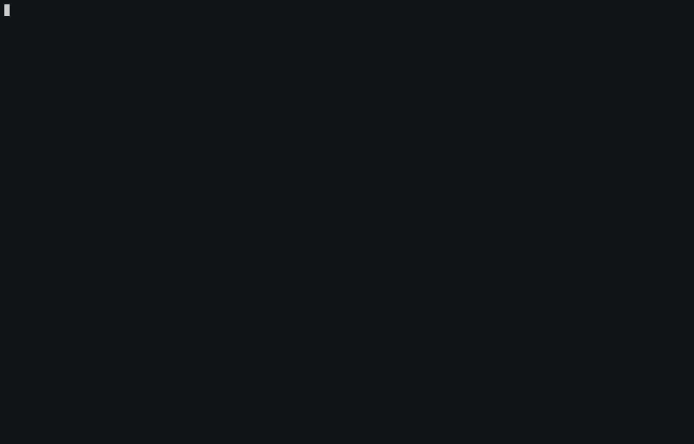

# aws-allowlister


[](https://twitter.com/kmcquade3)
[](https://pepy.tech/project/aws-allowlister)

Automatically compile an AWS Service Control Policy that ONLY allows AWS services that are compliant with your preferred compliance frameworks.



## Overview

AWS Service Control Policies (SCPs) allow you to control which AWS Service APIs are allowed *at the AWS Account level* - so local administrators (not even the account's root user) can perform prohibited actions in a child account.

 However, before `aws-allowlister`, it was very difficult and error-prone to create AWS AllowList SCPs - only giving accounts access to the compliant services that they need, and nothing else. Before `aws-allowlister`, the approach for creating an AllowList was:
1. Create a spreadsheet 🙄  based on the [AWS Services in Scope](https://aws.amazon.com/compliance/services-in-scope/) documentation, which have inconsistent naming and do not list the "IAM names"
2. Create an AllowList.json by hand, based on that spreadsheet
3. Roll it out to Dev/Stage/Production
4. Whoever manages that spreadsheet now magically owns the AllowList policy due to ✨tribal knowledge✨ and any updates occur by pinging this person over Slack.

`aws-allowlister` takes care of this process for you. Instead of following the painful process above, just run the following command to generate an AWS SCP policy that meets PCI compliance:

```bash
aws-allowlister generate --pci
```

The policies generated by `aws-allowlister` are based off of official AWS [documentation](https://aws.amazon.com/compliance/services-in-scope/) and are automatically kept up to date when new services achieve compliance or accreditation.


### Support statuses

`aws-allowlister` currently supports:

| Compliance Framework | Support Status |
|----------------------|----------------|
| PCI                  | ✅             |
| SOC 1, 2, and 3      | ✅             |
| ISO/IEC              | ✅             |
| HIPAA BAA            | ✅             |
| FedRAMP Moderate     | ✅             |
| FedRAMP High         | ✅             |
| DOD CC SRG (USA 🇺🇸)  | ✅             |
| HITRUST              | ⏱ Coming soon |
| IRAP (Australia 🇦🇺)  | ⏱ Coming soon |
| C5 (Germany 🇩🇪)      | ⏱ Coming soon |
| K-ISMS (Japan 🇯🇵)    | ⏱ Coming soon |
| ENS High (Spain 🇪🇸)  | ⏱ Coming soon |

### Forcibly include/exclude services

In addition to creating compliance-focused SCPs, `aws-allowlister` supports the ability to include or exclude services (IAM permissions) of your choice using the `--include` or `--exclude` flags. For more details related to policy customization, view the [Arguments](#arguments) section.

## Installation

* Python Pip:

```bash
pip3 install aws-allowlister
```

* Homebrew:

```bash
brew tap salesforce/aws-allowlister https://github.com/salesforce/aws-allowlister
brew install aws-allowlister
```

## Usage

* Generate an AllowList Policy using this command:

```bash
aws-allowlister generate
```

By default, it allows policies at the intersection of PCI, HIPAA, SOC, ISO, FedRAMP High, and FedRAMP Moderate.

The resulting policy will look like this:

<details>
<summary>Example AllowList Policy</summary>

```json
{
    "Version": "2012-10-17",
    "Statement": {
        "Sid": "AllowList",
        "Effect": "Deny",
        "NotAction": [
            "account:*",
            "acm:*",
            "amplify:*",
            "amplifybackend:*",
            "apigateway:*",
            "application-autoscaling:*",
            "appstream:*",
            "appsync:*",
            "athena:*",
            "autoscaling:*",
            "aws-portal:*",
            "backup:*",
            "batch:*",
            "clouddirectory:*",
            "cloudformation:*",
            "cloudfront:*",
            "cloudhsm:*",
            "cloudtrail:*",
            "cloudwatch:*",
            "codebuild:*",
            "codecommit:*",
            "codedeploy:*",
            "codepipeline:*",
            "cognito-identity:*",
            "cognito-idp:*",
            "comprehend:*",
            "comprehendmedical:*",
            "config:*",
            "connect:*",
            "dataexchange:*",
            "datasync:*",
            "directconnect:*",
            "dms:*",
            "ds:*",
            "dynamodb:*",
            "ebs:*",
            "ec2:*",
            "ecr:*",
            "ecs:*",
            "eks:*",
            "elasticache:*",
            "elasticbeanstalk:*",
            "elasticfilesystem:*",
            "elasticmapreduce:*",
            "es:*",
            "events:*",
            "execute-api:*",
            "firehose:*",
            "fms:*",
            "forecast:*",
            "freertos:*",
            "fsx:*",
            "glacier:*",
            "globalaccelerator:*",
            "glue:*",
            "greengrass:*",
            "guardduty:*",
            "health:*",
            "iam:*",
            "inspector:*",
            "iot:*",
            "iot-device-tester:*",
            "iotdeviceadvisor:*",
            "iotevents:*",
            "iotwireless:*",
            "kafka:*",
            "kinesis:*",
            "kinesisanalytics:*",
            "kinesisvideo:*",
            "kms:*",
            "lambda:*",
            "lex:*",
            "logs:*",
            "macie2:*",
            "mediaconnect:*",
            "mediaconvert:*",
            "medialive:*",
            "mq:*",
            "neptune-db:*",
            "opsworks-cm:*",
            "organizations:*",
            "outposts:*",
            "personalize:*",
            "polly:*",
            "qldb:*",
            "quicksight:*",
            "rds:*",
            "rds-data:*",
            "rds-db:*",
            "redshift:*",
            "rekognition:*",
            "robomaker:*",
            "route53:*",
            "route53domains:*",
            "s3:*",
            "sagemaker:*",
            "secretsmanager:*",
            "securityhub:*",
            "serverlessrepo:*",
            "servicecatalog:*",
            "shield:*",
            "sms:*",
            "sms-voice:*",
            "snowball:*",
            "sns:*",
            "sqs:*",
            "ssm:*",
            "sso:*",
            "sso-directory:*",
            "states:*",
            "storagegateway:*",
            "sts:*",
            "support:*",
            "swf:*",
            "textract:*",
            "transcribe:*",
            "transfer:*",
            "translate:*",
            "waf:*",
            "waf-regional:*",
            "wafv2:*",
            "workdocs:*",
            "worklink:*",
            "workspaces:*",
            "xray:*"
        ],
        "Resource": "*"
    }
}
```

</details>

### Markdown Table Output

* You can also specify the `--table` option to output the results in a Markdown Table format, as shown below:

```
aws-allowlister generate --pci --table
```

The results will look like this:

<details>
<summary>Example AllowList Policy</summary>

```
| Service Prefix          | Service Name                                    |
|-------------------------|-------------------------------------------------|
| account                 | AWS Accounts                                    |
| acm                     | AWS Certificate Manager                         |
| amplify                 | AWS Amplify                                     |
| amplifybackend          | AWS Amplify Admin                               |
| apigateway              | Manage Amazon API Gateway                       |
| application-autoscaling | Application Auto Scaling                        |
| appmesh                 | AWS App Mesh                                    |
| appstream               | Amazon AppStream 2.0                            |
| appsync                 | AWS AppSync                                     |
| athena                  | Amazon Athena                                   |
| autoscaling             | Amazon EC2 Auto Scaling                         |
| autoscaling-plans       | AWS Auto Scaling                                |
| aws-portal              | AWS Billing                                     |
| backup                  | AWS Backup                                      |
| batch                   | AWS Batch                                       |
| cassandra               | AWS Managed Apache Cassandra Service            |
| chatbot                 | AWS Chatbot                                     |
| clouddirectory          | Amazon Cloud Directory                          |
| cloudformation          | AWS CloudFormation                              |
| cloudfront              | Amazon CloudFront                               |
| cloudhsm                | AWS CloudHSM                                    |
| cloudtrail              | AWS CloudTrail                                  |
| cloudwatch              | Amazon CloudWatch                               |
| codebuild               | AWS CodeBuild                                   |
| codecommit              | AWS CodeCommit                                  |
| codedeploy              | AWS CodeDeploy                                  |
| codepipeline            | AWS CodePipeline                                |
| cognito-identity        | Amazon Cognito Identity                         |
| cognito-idp             | Amazon Cognito User Pools                       |
| cognito-sync            | Amazon Cognito Sync                             |
| comprehend              | Amazon Comprehend                               |
| comprehendmedical       | Comprehend Medical                              |
| config                  | AWS Config                                      |
| connect                 | Amazon Connect                                  |
| databrew                | AWS Glue DataBrew                               |
| dataexchange            | AWS Data Exchange                               |
| datasync                | DataSync                                        |
| directconnect           | AWS Direct Connect                              |
| dms                     | AWS Database Migration Service                  |
| ds                      | AWS Directory Service                           |
| dynamodb                | Amazon DynamoDB                                 |
| ebs                     | Amazon Elastic Block Store                      |
| ec2                     | Amazon EC2                                      |
| ec2messages             | Amazon Message Delivery Service                 |
| ecr                     | Amazon Elastic Container Registry               |
| ecs                     | Amazon Elastic Container Service                |
| eks                     | Amazon Elastic Container Service for Kubernetes |
| elasticache             | Amazon ElastiCache                              |
| elasticbeanstalk        | AWS Elastic Beanstalk                           |
| elasticfilesystem       | Amazon Elastic File System                      |
| elasticloadbalancing    | Elastic Load Balancing V2                       |
| elasticmapreduce        | Amazon Elastic MapReduce                        |
| es                      | Amazon Elasticsearch Service                    |
| events                  | Amazon EventBridge                              |
| execute-api             | Amazon API Gateway                              |
| firehose                | Amazon Kinesis Firehose                         |
| fms                     | AWS Firewall Manager                            |
| forecast                | Amazon Forecast                                 |
| freertos                | Amazon FreeRTOS                                 |
| fsx                     | Amazon FSx                                      |
| glacier                 | Amazon Glacier                                  |
| globalaccelerator       | AWS Global Accelerator                          |
| glue                    | AWS Glue                                        |
| greengrass              | AWS IoT Greengrass                              |
| groundstation           | AWS Ground Station                              |
| guardduty               | Amazon GuardDuty                                |
| health                  | AWS Health APIs and Notifications               |
| iam                     | Identity And Access Management                  |
| importexport            | AWS Import Export Disk Service                  |
| inspector               | Amazon Inspector                                |
| iot                     | AWS IoT                                         |
| iot-device-tester       | AWS IoT Device Tester                           |
| iotdeviceadvisor        | AWS IoT Core Device Advisor                     |
| iotevents               | AWS IoT Events                                  |
| iotwireless             | AWS IoT Core for LoRaWAN                        |
| kendra                  | Amazon Kendra                                   |
| kinesis                 | Amazon Kinesis                                  |
| kinesisanalytics        | Amazon Kinesis Analytics V2                     |
| kinesisvideo            | Amazon Kinesis Video Streams                    |
| kms                     | AWS Key Management Service                      |
| lakeformation           | AWS Lake Formation                              |
| lambda                  | AWS Lambda                                      |
| lex                     | Amazon Lex                                      |
| license-manager         | AWS License Manager                             |
| logs                    | Amazon CloudWatch Logs                          |
| macie                   | Amazon Macie Classic                            |
| macie2                  | Amazon Macie                                    |
| mediaconnect            | AWS Elemental MediaConnect                      |
| mediaconvert            | AWS Elemental MediaConvert                      |
| medialive               | AWS Elemental MediaLive                         |
| mobiletargeting         | Amazon Pinpoint                                 |
| mq                      | Amazon MQ                                       |
| neptune-db              | Amazon Neptune                                  |
| opsworks                | AWS OpsWorks                                    |
| opsworks-cm             | AWS OpsWorks Configuration Management           |
| organizations           | AWS Organizations                               |
| outposts                | AWS Outposts                                    |
| personalize             | Amazon Personalize                              |
| polly                   | Amazon Polly                                    |
| qldb                    | Amazon QLDB                                     |
| quicksight              | Amazon QuickSight                               |
| rds                     | Amazon RDS                                      |
| rds-data                | Amazon RDS Data API                             |
| rds-db                  | Amazon RDS IAM Authentication                   |
| redshift                | Amazon Redshift                                 |
| rekognition             | Amazon Rekognition                              |
| resource-groups         | AWS Resource Groups                             |
| robomaker               | AWS RoboMaker                                   |
| route53                 | Amazon Route 53                                 |
| route53domains          | Amazon Route53 Domains                          |
| s3                      | Amazon S3                                       |
| sagemaker               | Amazon SageMaker                                |
| sdb                     | Amazon SimpleDB                                 |
| secretsmanager          | AWS Secrets Manager                             |
| securityhub             | AWS Security Hub                                |
| serverlessrepo          | AWS Serverless Application Repository           |
| servicecatalog          | AWS Service Catalog                             |
| servicediscovery        | AWS Cloud Map                                   |
| shield                  | AWS Shield                                      |
| sms                     | AWS Server Migration Service                    |
| sms-voice               | Amazon Pinpoint SMS and Voice Service           |
| snowball                | AWS Snowball                                    |
| sns                     | Amazon SNS                                      |
| sqs                     | Amazon SQS                                      |
| ssm                     | AWS Systems Manager                             |
| ssmmessages             | Amazon Session Manager Message Gateway Service  |
| states                  | AWS Step Functions                              |
| storagegateway          | Amazon Storage Gateway                          |
| sts                     | AWS Security Token Service                      |
| support                 | AWS Support                                     |
| swf                     | Amazon Simple Workflow Service                  |
| textract                | Amazon Textract                                 |
| timestream              | AWS Timestream                                  |
| transcribe              | Amazon Transcribe                               |
| transfer                | AWS Transfer for SFTP                           |
| translate               | Amazon Translate                                |
| trustedadvisor          | AWS Trusted Advisor                             |
| waf                     | AWS WAF                                         |
| waf-regional            | AWS WAF Regional                                |
| wafv2                   | AWS WAF V2                                      |
| workdocs                | Amazon WorkDocs                                 |
| worklink                | Amazon WorkLink                                 |
| workspaces              | Amazon WorkSpaces                               |
| xray                    | AWS X-Ray                                       |
```

</details>

### Markdown Table of Excluded Services

* Let's say you want to know which services are **excluded**, not just the ones that are **included**. In this case, you can specify the `--excluded-table` option to output the list of services that are not allowed.

```
aws-allowlister generate --pci --excluded-table
```

The results will look like this:


<details>
<summary>Example AllowList Policy</summary>

```
| Service Prefix                | Service Name                                                                                                                                                                           |
|-------------------------------|----------------------------------------------------------------------------------------------------------------------------------------------------------------------------------------|
| a4b                           | [Alexa for Business](https://docs.aws.amazon.com/service-authorization/latest/reference/list_alexaforbusiness.html)                                                                    |
| acm-pca                       | [AWS Certificate Manager Private Certificate Authority](https://docs.aws.amazon.com/service-authorization/latest/reference/list_awscertificatemanagerprivatecertificateauthority.html) |
| activate                      | [AWS Activate](https://docs.aws.amazon.com/service-authorization/latest/reference/list_awsactivate.html)                                                                               |
| airflow                       | [Amazon Managed Workflows for Apache Airflow](https://docs.aws.amazon.com/service-authorization/latest/reference/list_amazonmanagedworkflowsforapacheairflow.html)                     |
| app-integrations              | [Amazon AppIntegrations](https://docs.aws.amazon.com/service-authorization/latest/reference/list_amazonappintegrations.html)                                                           |
| appconfig                     | [AWS AppConfig](https://docs.aws.amazon.com/service-authorization/latest/reference/list_awsappconfig.html)                                                                             |
| appflow                       | [Amazon AppFlow](https://docs.aws.amazon.com/service-authorization/latest/reference/list_amazonappflow.html)                                                                           |
| applicationinsights           | [CloudWatch Application Insights](https://docs.aws.amazon.com/service-authorization/latest/reference/list_cloudwatchapplicationinsights.html)                                          |
| appmesh                       | [AWS App Mesh](https://docs.aws.amazon.com/service-authorization/latest/reference/list_awsappmesh.html)                                                                                |
| appmesh-preview               | [AWS App Mesh Preview](https://docs.aws.amazon.com/service-authorization/latest/reference/list_awsappmeshpreview.html)                                                                 |
| aps                           | [Amazon Managed Service for Prometheus](https://docs.aws.amazon.com/service-authorization/latest/reference/list_amazonmanagedserviceforprometheus.html)                                |
| arsenal                       | [Application Discovery Arsenal](https://docs.aws.amazon.com/service-authorization/latest/reference/list_applicationdiscoveryarsenal.html)                                              |
| artifact                      | [AWS Artifact](https://docs.aws.amazon.com/service-authorization/latest/reference/list_awsartifact.html)                                                                               |
| auditmanager                  | [AWS Audit Manager](https://docs.aws.amazon.com/service-authorization/latest/reference/list_awsauditmanager.html)                                                                      |
| aws-marketplace               | [AWS Private Marketplace](https://docs.aws.amazon.com/service-authorization/latest/reference/list_awsprivatemarketplace.html)                                                          |
| aws-marketplace-management    | [AWS Marketplace Management Portal](https://docs.aws.amazon.com/service-authorization/latest/reference/list_awsmarketplacemanagementportal.html)                                       |
| awsconnector                  | [AWS Connector Service](https://docs.aws.amazon.com/service-authorization/latest/reference/list_awsconnectorservice.html)                                                              |
| braket                        | [Amazon Braket](https://docs.aws.amazon.com/service-authorization/latest/reference/list_amazonbraket.html)                                                                             |
| budgets                       | [AWS Budget Service](https://docs.aws.amazon.com/service-authorization/latest/reference/list_awsbudgetservice.html)                                                                    |
| cassandra                     | [AWS Managed Apache Cassandra Service](https://docs.aws.amazon.com/service-authorization/latest/reference/list_awsmanagedapachecassandraservice.html)                                  |
| ce                            | [AWS Cost Explorer Service](https://docs.aws.amazon.com/service-authorization/latest/reference/list_awscostexplorerservice.html)                                                       |
| chatbot                       | [AWS Chatbot](https://docs.aws.amazon.com/service-authorization/latest/reference/list_awschatbot.html)                                                                                 |
| chime                         | [Amazon Chime](https://docs.aws.amazon.com/service-authorization/latest/reference/list_amazonchime.html)                                                                               |
| cloud9                        | [AWS Cloud9](https://docs.aws.amazon.com/service-authorization/latest/reference/list_awscloud9.html)                                                                                   |
| cloudsearch                   | [Amazon CloudSearch](https://docs.aws.amazon.com/service-authorization/latest/reference/list_amazoncloudsearch.html)                                                                   |
| cloudshell                    | [AWS CloudShell](https://docs.aws.amazon.com/service-authorization/latest/reference/list_awscloudshell.html)                                                                           |
| codeartifact                  | [AWS CodeArtifact](https://docs.aws.amazon.com/service-authorization/latest/reference/list_awscodeartifact.html)                                                                       |
| codeguru                      | [Amazon CodeGuru](https://docs.aws.amazon.com/service-authorization/latest/reference/list_amazoncodeguru.html)                                                                         |
| codeguru-profiler             | [Amazon CodeGuru Profiler](https://docs.aws.amazon.com/service-authorization/latest/reference/list_amazoncodeguruprofiler.html)                                                        |
| codeguru-reviewer             | [Amazon CodeGuru Reviewer](https://docs.aws.amazon.com/service-authorization/latest/reference/list_amazoncodegurureviewer.html)                                                        |
| codestar                      | [AWS CodeStar](https://docs.aws.amazon.com/service-authorization/latest/reference/list_awscodestar.html)                                                                               |
| codestar-connections          | [AWS CodeStar Connections](https://docs.aws.amazon.com/service-authorization/latest/reference/list_awscodestarconnections.html)                                                        |
| codestar-notifications        | [AWS CodeStar Notifications](https://docs.aws.amazon.com/service-authorization/latest/reference/list_awscodestarnotifications.html)                                                    |
| compute-optimizer             | [Compute Optimizer](https://docs.aws.amazon.com/service-authorization/latest/reference/list_computeoptimizer.html)                                                                     |
| cur                           | [AWS Cost and Usage Report](https://docs.aws.amazon.com/service-authorization/latest/reference/list_awscostandusagereport.html)                                                        |
| databrew                      | [AWS Glue DataBrew](https://docs.aws.amazon.com/service-authorization/latest/reference/list_awsgluedatabrew.html)                                                                      |
| datapipeline                  | [Data Pipeline](https://docs.aws.amazon.com/service-authorization/latest/reference/list_datapipeline.html)                                                                             |
| dax                           | [Amazon DynamoDB Accelerator (DAX)](https://docs.aws.amazon.com/service-authorization/latest/reference/list_amazondynamodbacceleratordax.html)                                         |
| dbqms                         | [Database Query Metadata Service](https://docs.aws.amazon.com/service-authorization/latest/reference/list_databasequerymetadataservice.html)                                           |
| deepcomposer                  | [AWS DeepComposer](https://docs.aws.amazon.com/service-authorization/latest/reference/list_awsdeepcomposer.html)                                                                       |
| deeplens                      | [AWS DeepLens](https://docs.aws.amazon.com/service-authorization/latest/reference/list_awsdeeplens.html)                                                                               |
| deepracer                     | [AWS DeepRacer](https://docs.aws.amazon.com/service-authorization/latest/reference/list_awsdeepracer.html)                                                                             |
| detective                     | [Amazon Detective](https://docs.aws.amazon.com/service-authorization/latest/reference/list_amazondetective.html)                                                                       |
| devicefarm                    | [AWS Device Farm](https://docs.aws.amazon.com/service-authorization/latest/reference/list_awsdevicefarm.html)                                                                          |
| devops-guru                   | [Amazon DevOps Guru](https://docs.aws.amazon.com/service-authorization/latest/reference/list_amazondevopsguru.html)                                                                    |
| discovery                     | [Application Discovery](https://docs.aws.amazon.com/service-authorization/latest/reference/list_applicationdiscovery.html)                                                             |
| dlm                           | [Amazon Data Lifecycle Manager](https://docs.aws.amazon.com/service-authorization/latest/reference/list_amazondatalifecyclemanager.html)                                               |
| ec2-instance-connect          | [Amazon EC2 Instance Connect](https://docs.aws.amazon.com/service-authorization/latest/reference/list_amazonec2instanceconnect.html)                                                   |
| ecr-public                    | [Amazon Elastic Container Registry Public](https://docs.aws.amazon.com/service-authorization/latest/reference/list_amazonelasticcontainerregistrypublic.html)                          |
| elastic-inference             | [Amazon Elastic Inference](https://docs.aws.amazon.com/service-authorization/latest/reference/list_amazonelasticinference.html)                                                        |
| elastictranscoder             | [Amazon Elastic Transcoder](https://docs.aws.amazon.com/service-authorization/latest/reference/list_amazonelastictranscoder.html)                                                      |
| elemental-activations         | [Elemental Activations](https://docs.aws.amazon.com/service-authorization/latest/reference/list_elementalactivations.html)                                                             |
| elemental-appliances-software | [AWS Elemental Appliances and Software](https://docs.aws.amazon.com/service-authorization/latest/reference/list_awselementalappliancesandsoftware.html)                                |
| elemental-support-cases       | [Elemental Support Cases](https://docs.aws.amazon.com/service-authorization/latest/reference/list_elementalsupportcases.html)                                                          |
| elemental-support-content     | [Elemental Support Content](https://docs.aws.amazon.com/service-authorization/latest/reference/list_elementalsupportcontent.html)                                                      |
| emr-containers                | [Amazon EMR on EKS (EMR Containers)](https://docs.aws.amazon.com/service-authorization/latest/reference/list_amazonemroneksemrcontainers.html)                                         |
| fis                           | [AWS Fault Injection Simulator](https://docs.aws.amazon.com/service-authorization/latest/reference/list_awsfaultinjectionsimulator.html)                                               |
| frauddetector                 | [Amazon Fraud Detector](https://docs.aws.amazon.com/service-authorization/latest/reference/list_amazonfrauddetector.html)                                                              |
| gamelift                      | [Amazon GameLift](https://docs.aws.amazon.com/service-authorization/latest/reference/list_amazongamelift.html)                                                                         |
| geo                           | [Amazon Location](https://docs.aws.amazon.com/service-authorization/latest/reference/list_amazonlocation.html)                                                                         |
| grafana                       | [Amazon Managed Service for Grafana](https://docs.aws.amazon.com/service-authorization/latest/reference/list_amazonmanagedserviceforgrafana.html)                                      |
| groundstation                 | [AWS Ground Station](https://docs.aws.amazon.com/service-authorization/latest/reference/list_awsgroundstation.html)                                                                    |
| groundtruthlabeling           | [Amazon GroundTruth Labeling](https://docs.aws.amazon.com/service-authorization/latest/reference/list_amazongroundtruthlabeling.html)                                                  |
| healthlake                    | [Amazon HealthLake](https://docs.aws.amazon.com/service-authorization/latest/reference/list_amazonhealthlake.html)                                                                     |
| honeycode                     | [Amazon Honeycode](https://docs.aws.amazon.com/service-authorization/latest/reference/list_amazonhoneycode.html)                                                                       |
| identitystore                 | [AWS Identity Store](https://docs.aws.amazon.com/service-authorization/latest/reference/list_awsidentitystore.html)                                                                    |
| imagebuilder                  | [Amazon EC2 Image Builder](https://docs.aws.amazon.com/service-authorization/latest/reference/list_amazonec2imagebuilder.html)                                                         |
| iot1click                     | [AWS IoT 1-Click](https://docs.aws.amazon.com/service-authorization/latest/reference/list_awsiot1-click.html)                                                                          |
| iotanalytics                  | [AWS IoT Analytics](https://docs.aws.amazon.com/service-authorization/latest/reference/list_awsiotanalytics.html)                                                                      |
| iotfleethub                   | [Fleet Hub for AWS IoT Device Management](https://docs.aws.amazon.com/service-authorization/latest/reference/list_fleethubforawsiotdevicemanagement.html)                              |
| iotsitewise                   | [AWS IoT SiteWise](https://docs.aws.amazon.com/service-authorization/latest/reference/list_awsiotsitewise.html)                                                                        |
| iotthingsgraph                | [AWS IoT Things Graph](https://docs.aws.amazon.com/service-authorization/latest/reference/list_awsiotthingsgraph.html)                                                                 |
| iq                            | [AWS IQ](https://docs.aws.amazon.com/service-authorization/latest/reference/list_awsiq.html)                                                                                           |
| iq-permission                 | [AWS IQ Permissions](https://docs.aws.amazon.com/service-authorization/latest/reference/list_awsiqpermissions.html)                                                                    |
| ivs                           | [Amazon Interactive Video Service](https://docs.aws.amazon.com/service-authorization/latest/reference/list_amazoninteractivevideoservice.html)                                         |
| kendra                        | [Amazon Kendra](https://docs.aws.amazon.com/service-authorization/latest/reference/list_amazonkendra.html)                                                                             |
| launchwizard                  | [Launch Wizard](https://docs.aws.amazon.com/service-authorization/latest/reference/list_launchwizard.html)                                                                             |
| lex                           | [Amazon Lex V2](https://docs.aws.amazon.com/service-authorization/latest/reference/list_amazonlexv2.html)                                                                              |
| license-manager               | [AWS License Manager](https://docs.aws.amazon.com/service-authorization/latest/reference/list_awslicensemanager.html)                                                                  |
| lightsail                     | [Amazon Lightsail](https://docs.aws.amazon.com/service-authorization/latest/reference/list_amazonlightsail.html)                                                                       |
| lookoutequipment              | [Amazon Lookout for Equipment](https://docs.aws.amazon.com/service-authorization/latest/reference/list_amazonlookoutforequipment.html)                                                 |
| lookoutmetrics                | [Amazon Lookout for Metrics](https://docs.aws.amazon.com/service-authorization/latest/reference/list_amazonlookoutformetrics.html)                                                     |
| lookoutvision                 | [Amazon Lookout for Vision](https://docs.aws.amazon.com/service-authorization/latest/reference/list_amazonlookoutforvision.html)                                                       |
| machinelearning               | [Amazon Machine Learning](https://docs.aws.amazon.com/service-authorization/latest/reference/list_amazonmachinelearning.html)                                                          |
| managedblockchain             | [Amazon Managed Blockchain](https://docs.aws.amazon.com/service-authorization/latest/reference/list_amazonmanagedblockchain.html)                                                      |
| marketplacecommerceanalytics  | [AWS Marketplace Commerce Analytics Service](https://docs.aws.amazon.com/service-authorization/latest/reference/list_awsmarketplacecommerceanalyticsservice.html)                      |
| mechanicalturk                | [Amazon Mechanical Turk](https://docs.aws.amazon.com/service-authorization/latest/reference/list_amazonmechanicalturk.html)                                                            |
| mediapackage                  | [AWS Elemental MediaPackage](https://docs.aws.amazon.com/service-authorization/latest/reference/list_awselementalmediapackage.html)                                                    |
| mediapackage-vod              | [AWS Elemental MediaPackage VOD](https://docs.aws.amazon.com/service-authorization/latest/reference/list_awselementalmediapackagevod.html)                                             |
| mediastore                    | [AWS Elemental MediaStore](https://docs.aws.amazon.com/service-authorization/latest/reference/list_awselementalmediastore.html)                                                        |
| mediatailor                   | [AWS Elemental MediaTailor](https://docs.aws.amazon.com/service-authorization/latest/reference/list_awselementalmediatailor.html)                                                      |
| mgh                           | [AWS Migration Hub](https://docs.aws.amazon.com/service-authorization/latest/reference/list_awsmigrationhub.html)                                                                      |
| mobileanalytics               | [Amazon Mobile Analytics](https://docs.aws.amazon.com/service-authorization/latest/reference/list_amazonmobileanalytics.html)                                                          |
| mobilehub                     | [AWS Mobile Hub](https://docs.aws.amazon.com/service-authorization/latest/reference/list_awsmobilehub.html)                                                                            |
| monitron                      | [Amazon Monitron](https://docs.aws.amazon.com/service-authorization/latest/reference/list_amazonmonitron.html)                                                                         |
| network-firewall              | [AWS Network Firewall](https://docs.aws.amazon.com/service-authorization/latest/reference/list_awsnetworkfirewall.html)                                                                |
| networkmanager                | [Network Manager](https://docs.aws.amazon.com/service-authorization/latest/reference/list_networkmanager.html)                                                                         |
| panorama                      | [AWS Panorama](https://docs.aws.amazon.com/service-authorization/latest/reference/list_awspanorama.html)                                                                               |
| pi                            | [AWS Performance Insights](https://docs.aws.amazon.com/service-authorization/latest/reference/list_awsperformanceinsights.html)                                                        |
| pricing                       | [AWS Price List](https://docs.aws.amazon.com/service-authorization/latest/reference/list_awspricelist.html)                                                                            |
| profile                       | [Amazon Connect Customer Profiles](https://docs.aws.amazon.com/service-authorization/latest/reference/list_amazonconnectcustomerprofiles.html)                                         |
| proton                        | [AWS Proton](https://docs.aws.amazon.com/service-authorization/latest/reference/list_awsproton.html)                                                                                   |
| purchase-orders               | [AWS Purchase Orders Console](https://docs.aws.amazon.com/service-authorization/latest/reference/list_awspurchaseordersconsole.html)                                                   |
| ram                           | [AWS Resource Access Manager](https://docs.aws.amazon.com/service-authorization/latest/reference/list_awsresourceaccessmanager.html)                                                   |
| redshift-data                 | [Amazon Redshift Data API](https://docs.aws.amazon.com/service-authorization/latest/reference/list_amazonredshiftdataapi.html)                                                         |
| resource-explorer             | [AWS Tag Editor](https://docs.aws.amazon.com/service-authorization/latest/reference/list_awstageditor.html)                                                                            |
| resource-groups               | [AWS Resource Groups](https://docs.aws.amazon.com/service-authorization/latest/reference/list_awsresourcegroups.html)                                                                  |
| s3-object-lambda              | [Amazon S3 Object Lambda](https://docs.aws.amazon.com/service-authorization/latest/reference/list_amazons3objectlambda.html)                                                           |
| s3-outposts                   | [Amazon S3 on Outposts](https://docs.aws.amazon.com/service-authorization/latest/reference/list_amazons3onoutposts.html)                                                               |
| savingsplans                  | [AWS Savings Plans](https://docs.aws.amazon.com/service-authorization/latest/reference/list_awssavingsplans.html)                                                                      |
| schemas                       | [Amazon EventBridge Schemas](https://docs.aws.amazon.com/service-authorization/latest/reference/list_amazoneventbridgeschemas.html)                                                    |
| sdb                           | [Amazon SimpleDB](https://docs.aws.amazon.com/service-authorization/latest/reference/list_amazonsimpledb.html)                                                                         |
| servicediscovery              | [AWS Cloud Map](https://docs.aws.amazon.com/service-authorization/latest/reference/list_awscloudmap.html)                                                                              |
| servicequotas                 | [Service Quotas](https://docs.aws.amazon.com/service-authorization/latest/reference/list_servicequotas.html)                                                                           |
| ses                           | [Amazon Simple Email Service v2](https://docs.aws.amazon.com/service-authorization/latest/reference/list_amazonsimpleemailservicev2.html)                                              |
| signer                        | [AWS Signer](https://docs.aws.amazon.com/service-authorization/latest/reference/list_awssigner.html)                                                                                   |
| sms-voice                     | [Amazon Pinpoint SMS and Voice Service](https://docs.aws.amazon.com/service-authorization/latest/reference/list_amazonpinpointsmsandvoiceservice.html)                                 |
| sso                           | [AWS SSO](https://docs.aws.amazon.com/service-authorization/latest/reference/list_awssso.html)                                                                                         |
| sso-directory                 | [AWS SSO Directory](https://docs.aws.amazon.com/service-authorization/latest/reference/list_awsssodirectory.html)                                                                      |
| sumerian                      | [Amazon Sumerian](https://docs.aws.amazon.com/service-authorization/latest/reference/list_amazonsumerian.html)                                                                         |
| synthetics                    | [Amazon CloudWatch Synthetics](https://docs.aws.amazon.com/service-authorization/latest/reference/list_amazoncloudwatchsynthetics.html)                                                |
| tag                           | [Amazon Resource Group Tagging API](https://docs.aws.amazon.com/service-authorization/latest/reference/list_amazonresourcegrouptaggingapi.html)                                        |
| timestream                    | [AWS Timestream](https://docs.aws.amazon.com/service-authorization/latest/reference/list_awstimestream.html)                                                                           |
| tiros                         | [AWS Tiros](https://docs.aws.amazon.com/service-authorization/latest/reference/list_awstiros.html)                                                                                     |
| trustedadvisor                | [AWS Trusted Advisor](https://docs.aws.amazon.com/service-authorization/latest/reference/list_awstrustedadvisor.html)                                                                  |
| wam                           | [Amazon WorkSpaces Application Manager](https://docs.aws.amazon.com/service-authorization/latest/reference/list_amazonworkspacesapplicationmanager.html)                               |
| wellarchitected               | [AWS Well-Architected Tool](https://docs.aws.amazon.com/service-authorization/latest/reference/list_awswell-architectedtool.html)                                                      |
| workmail                      | [Amazon WorkMail](https://docs.aws.amazon.com/service-authorization/latest/reference/list_amazonworkmail.html)                                                                         |
| workmailmessageflow           | [Amazon WorkMail Message Flow](https://docs.aws.amazon.com/service-authorization/latest/reference/list_amazonworkmailmessageflow.html)                                                 |
```

</details>

## Arguments

`aws-allowlister` supports different arguments to generate fine-grained compliance focused Service Control Policy (SCP) AllowLists. You can specify individual flags for the compliance frameworks you care about.

```
Usage: aws-allowlister generate [OPTIONS]

Options:
  Compliance Standard Selection: 
    -a, --all                     SOC, PCI, ISO, HIPAA, FedRAMP_High, and
                                  FedRAMP_Moderate.

    -s, --soc                     Include SOC-compliant services
    -p, --pci                     Include PCI-compliant services
    -h, --hipaa                   Include HIPAA-compliant services
    -i, --iso                     Include ISO-compliant services
    -fh, --fedramp-high           Include FedRAMP High
    -fm, --fedramp-moderate       Include FedRAMP Moderate
    -d2e, --dodccsrg-il2-ew       Include DoD CC SRG IL2 (East/West)
    -d2g, --dodccsrg-il2-gc       Include DoD CC SRG IL2 (GovCloud)
    -d4g, --dodccsrg-il4-gc       Include DoD CC SRG IL4 (GovCloud)
    -d5g, --dodccsrg-il5-gc       Include DoD CC SRG IL5 (GovCloud)
  Forcibly Include AWS Services: [mutually_exclusive]
    --include TEXT                Include specific AWS IAM services, specified
                                  in a comma separated string.

    --include-file PATH           A YAML file that contains a list of AWS IAM
                                  services to include.

  Forcibly Exclude AWS Services: [mutually_exclusive]
    --exclude TEXT                Exclude specific AWS IAM services, specified
                                  in a comma separated string.

    --exclude-file PATH           A YAML file that contains a list of AWS IAM
                                  services to exclude.

  Table output options: [mutually_exclusive]
    --table                       Output a markdown-formatted table of the
                                  Service Prefixes alongside Service Names.

    --excluded-table              Output a markdown-formatted table of
                                  *excluded* services.

  -q, --quiet
  --help                          Show this message and exit.
```


* For example, to generate a PCI only Service Control Policy and save it to JSON:

```bash
aws-allowlister generate --pci --quiet > pci.json
```

* You can also chain command flags together. For example, to generate a Policy for all the major compliance frameworks but FedRAMP:

```bash
aws-allowlister generate -sphi --quiet
```

* Let's say your organization is not subject to FedRAMP or HIPAA, but you want to create a Policy for SOC, ISO, and PCI:

```bash
aws-allowlister generate -sip --quiet
```

### Exceptions: Including or Excluding Services

If you want to force-exclude or force-include a service, you have two options.
1. Specify the exclusions in command line arguments
2. Specify the exclusions in a YAML file and supply the file name

#### Example: Exclude Services using a file

For example, create a file that is called `exclusions.yml` with the following contents

```yaml
# If you use this for exclusions, this will exclude EC2 and S3. Don't actually do this, this is just for the example
- ec2
- s3
```

Now you can specify the following arguments to leverage this file:

```bash
aws-allowlister generate --exclude-file exclusions.yml
```

Alternatively, you can supply the argument inline like this:

```bash
aws-allowlister generate ---exclude ec2,s3
```

Notice how the output does not include `ec2` or `s3` in the output.


<details>
<summary>Exclude output</summary>

```
{
    "Version": "2012-10-17",
        "Statement": {
            "Sid": "AllowList",
            "Effect": "Deny",
            "Resource": "*",
            "NotAction": ["access-analyzer:*", "account:*", "acm:*", "amplify:*", "amplifybackend:*", "apigateway:*", "application-autoscaling:*", "appstream:*", "appsync:*", "athena:*", "autoscaling:*", "autoscaling-plans:*", "aws-portal:*", "backup:*", "backup-storage:*", "batch:*", "clouddirectory:*", "cloudformation:*", "cloudfront:*", "cloudhsm:*", "cloudtrail:*", "cloudwatch:*", "codebuild:*", "codecommit:*", "codedeploy:*", "codepipeline:*", "cognito-identity:*", "cognito-idp:*", "cognito-sync:*", "comprehend:*", "comprehendmedical:*", "config:*", "connect:*", "dataexchange:*", "datasync:*", "directconnect:*", "dms:*", "ds:*", "dynamodb:*", "ebs:*", "ec2messages:*", "ecr:*", "ecs:*", "eks:*", "elasticache:*", "elasticbeanstalk:*", "elasticfilesystem:*", "elasticloadbalancing:*", "elasticmapreduce:*", "es:*", "events:*", "execute-api:*", "firehose:*", "fms:*", "forecast:*", "freertos:*", "fsx:*", "glacier:*", "globalaccelerator:*", "glue:*", "greengrass:*", "guardduty:*", "health:*", "iam:*", "importexport:*", "inspector:*", "iot:*", "iot-device-tester:*", "iotdeviceadvisor:*", "iotevents:*", "iotwireless:*", "kafka:*", "kinesis:*", "kinesisanalytics:*", "kinesisvideo:*", "kms:*", "lakeformation:*", "lambda:*", "logs:*", "macie:*", "macie2:*", "mediaconnect:*", "mediaconvert:*", "medialive:*", "mobiletargeting:*", "mq:*", "neptune-db:*", "opsworks:*", "opsworks-cm:*", "organizations:*", "outposts:*", "personalize:*", "polly:*", "qldb:*", "quicksight:*", "rds:*", "rds-data:*", "rds-db:*", "redshift:*", "rekognition:*", "robomaker:*", "route53:*", "route53domains:*", "route53resolver:*", "sagemaker:*", "secretsmanager:*", "securityhub:*", "serverlessrepo:*", "servicecatalog:*", "shield:*", "sms:*", "snowball:*", "sns:*", "sqs:*", "ssm:*", "ssmmessages:*", "states:*", "storagegateway:*", "sts:*", "support:*", "swf:*", "textract:*", "transcribe:*", "transfer:*", "translate:*", "waf:*", "waf-regional:*", "wafv2:*", "workdocs:*", "worklink:*", "workspaces:*", "xray:*"]
        }
}
```

</details>


#### Example: Including a service using a file

You can also use this approach for force-including services. Let's say that you want to include the AWS Managed BlockChain Services because your CEO is convinced you're going to the moon 🚀 (even though the AWS Managed BlockChain service does not meet any common compliance frameworks like PCI or HIPAA). You could create a file called `include.yml` with the contents:

```yaml
- managedblockchain
```

Then run the following command:

```bash
aws-allowlister generate --exclude-file exclusions.yml
```

Alternatively, you can supply the argument inline like this:

```bash
aws-allowlister generate --include managedblockchain
```

Notice how the output includes the `managedblockchain` service.

<details>
<summary>Output with managed blockchain</summary>
<p>

```
{
    "Version": "2012-10-17",
        "Statement": {
            "Sid": "AllowList",
            "Effect": "Deny",
            "Resource": "*",
            "NotAction": ["access-analyzer:*", "account:*", "acm:*", "apigateway:*", "application-autoscaling:*", "appstream:*", "athena:*", "autoscaling:*", "autoscaling-plans:*", "aws-portal:*", "batch:*", "clouddirectory:*", "cloudformation:*", "cloudtrail:*", "cloudwatch:*", "codebuild:*", "codecommit:*", "codedeploy:*", "comprehend:*", "config:*", "datasync:*", "directconnect:*", "dms:*", "ds:*", "dynamodb:*", "ebs:*", "ec2:*", "ec2messages:*", "ecr:*", "ecs:*", "elasticache:*", "elasticbeanstalk:*", "elasticfilesystem:*", "elasticloadbalancing:*", "elasticmapreduce:*", "es:*", "events:*", "execute-api:*", "firehose:*", "glacier:*", "glue:*", "guardduty:*", "iam:*", "importexport:*", "inspector:*", "iot:*", "iot-device-tester:*", "iotdeviceadvisor:*", "iotwireless:*", "kinesis:*", "kms:*", "lakeformation:*", "lambda:*", "logs:*", "managedblockchain:*", "mediaconvert:*", "organizations:*", "polly:*", "rds:*", "rds-data:*", "rds-db:*", "redshift:*", "rekognition:*", "route53:*", "route53domains:*", "route53resolver:*", "s3:*", "sagemaker:*", "secretsmanager:*", "serverlessrepo:*", "servicecatalog:*", "sms:*", "snowball:*", "sns:*", "sqs:*", "ssm:*", "ssmmessages:*", "states:*", "sts:*", "support:*", "swf:*", "transcribe:*", "translate:*", "waf:*", "waf-regional:*", "wafv2:*", "workspaces:*"]
        }
}
```
</details>

# Contributing

## Setup

* Set up the virtual environment

```bash
# Set up the virtual environment
python3 -m venv ./venv && source venv/bin/activate
pip3 install -r requirements.txt
```

* Build the package

```bash
# To build only
make build

# To build and install
make install

# To run tests
make test

# To clean local dev environment
make clean
```

## Other tasks

* Update with the latest AWS Compliance data

```bash
make update-data
```

# Authors and Contributors

* [Kinnaird McQuade (@kmcquade3)](https://twitter.com/kmcquade3), Salesforce - Author
* [Jason Dyke (@jasonadyke)](https://twitter.com/jasonadyke), ScaleSec - Contributor

# 🚨 Disclaimer 🚨

The policies generated by `aws-allowlister` do not guarantee that your AWS accounts will be compliant or that you will become accredited with the supported compliance frameworks. These policies are intended to be a useful tool to assist with restricting which service can or cannot be leveraged.
